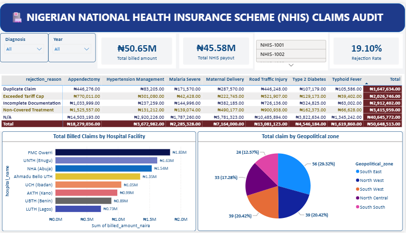

# 🏥 End-to-End NHIS Claims Audit Pipeline (Nigeria)

## 📌 Executive Summary
This project builds a full-scale clinical data pipeline analyzing 1,000 synthetic National Health Insurance Scheme (NHIS) claims across major teaching hospitals in Nigeria. The solution uncovers financial leakage patterns, documentation errors, and diagnostic discrepancies - surfacing where claim rejections are concentrated and why, to support tariff and policy decisions.

## 🛠️ Tech Stack & Workflow Architecture
1. **Python (Pandas/NumPy):** Data generation engine mapping regional costs and simulating transactional insurance claims across hospitals, diagnoses, and geopolitical zones.
2. **MySQL Workbench:** Relational database storage warehouse. Executed conditional aggregations and structural audits to validate claim integrity before reporting.
3. **Power BI Desktop:** Executive presentation tier combining real-time slicers, matrix pivots, and KPI cards for at-a-glance auditing.

## 🔍 Methodology
- Designed a relational schema in MySQL to hold claims, hospitals, diagnoses, and rejection reasons, with foreign-key integrity across tables.
- Used conditional SQL aggregations (`CASE WHEN` / `GROUP BY`) to classify claims by rejection reason and compute billed-vs-payout variance per diagnosis and facility.
- Built a Power BI matrix visual cross-tabbing rejection reason against diagnosis category, with a DAX measure for Rejection Rate (`DIVIDE(Rejected Claims, Total Claims)`) driving the headline KPI card.
- Added Region and Year slicers to let stakeholders isolate leakage patterns by geopolitical zone and time period.

## 🔍 Core Business Insights
- Baseline systemic insurance claim rejection rate of **19.10%** across all claims analyzed.
- **Non-Covered Treatment** (₦3.42M) and **Incomplete Documentation** (₦2.91M) are the two largest sources of claim value lost to rejection — together accounting for the majority of leakage.
- Identified specific surgical and clinical categories (e.g., Appendectomy, Hypertension Management) experiencing recurring documentation errors tied to rigid institutional tariff caps.
- South East and North West geopolitical zones account for nearly 50% of total claims by volume, pinpointing where administrative/audit resources would have the highest impact.

## ⚠️ Limitations
- Claims data is synthetically generated (via the included Python script) to approximate realistic NHIS claim patterns; it does not represent actual patient or hospital records.
- Regional cost mappings are simplified estimates and should not be used for real tariff-setting without validation against actual NHIS rate schedules.

## 📂 Repository Contents
- `nigeria_nhis_claim.ipynb` - Python scripts used to generate the synthetic claims dataset
- `hospital_rejection_query.sql` - MySQL schema and audit queries
- `NHIS Analysis` - Power BI (.pbix) dashboard file
- `NHIS_Claim_Analysis_Dashboard` - Dashboard preview images
